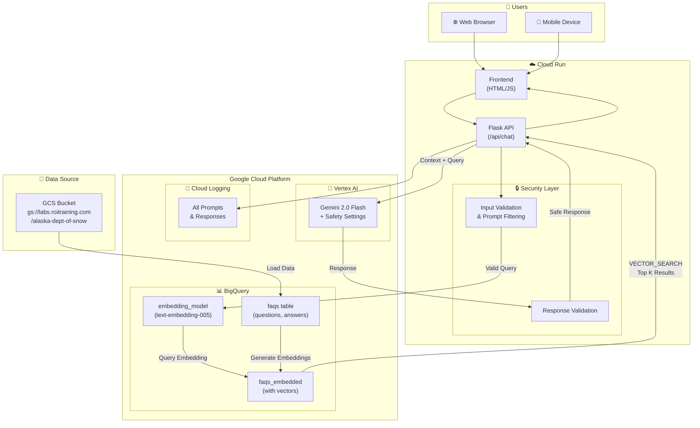
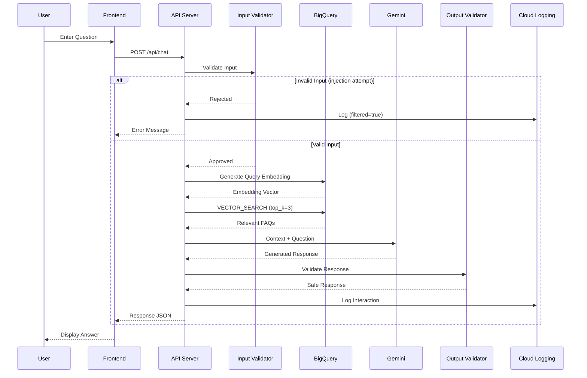

# Alaska Department of Snow - Chatbot Architecture

## System Architecture Diagram

## Data Flow

## Component Details

### 1. Frontend (Cloud Run)
- Simple HTML/CSS/JavaScript chat interface
- Hosted within the same Cloud Run service
- No external dependencies

### 2. Backend API (Flask)
- `/` - Serves chat interface
- `/api/chat` - Main chat endpoint
- `/api/health` - Health check

### 3. Security Features
| Feature | Implementation |
|---------|----------------|
| Input Validation | Length limits, empty check |
| Prompt Injection Detection | Pattern matching for known attacks |
| Safety Settings | Gemini's built-in harm categories |
| Response Validation | Filter leaked instructions |
| Logging | All interactions logged to Cloud Logging |

### 4. RAG System (BigQuery)
- **Data**: FAQ CSV loaded from GCS
- **Embeddings**: text-embedding-005 via BigQuery ML
- **Search**: VECTOR_SEARCH function for semantic matching
- **Top-K**: Returns 3 most relevant FAQ entries

### 5. Generation (Vertex AI)
- **Model**: Gemini 2.0 Flash
- **System Instructions**: ADS-specific behavior
- **Safety Settings**: Block medium and above for all harm categories

### 6. Logging (Cloud Logging)
All interactions logged with:
- Timestamp
- User query
- Response
- Context used
- Filter status

## Cost Considerations

| Service | Pricing Model | Est. Monthly Cost |
|---------|---------------|-------------------|
| Cloud Run | Per request + CPU/Memory | ~$5-20 |
| BigQuery | Storage + Query processing | ~$1-5 |
| Vertex AI (Gemini) | Per 1M tokens | ~$5-50 |
| Cloud Logging | Per GB ingested | ~$0.50 |

**Total Estimated**: $15-100/month depending on usage

## Security & Privacy

1. **Data Residency**: All data stays in GCP US region
2. **No PII Storage**: System doesn't collect/store personal data
3. **Audit Trail**: Complete logging of all interactions
4. **Input Sanitization**: Prevents prompt injection attacks
5. **Access Control**: IAM-based access to GCP resources